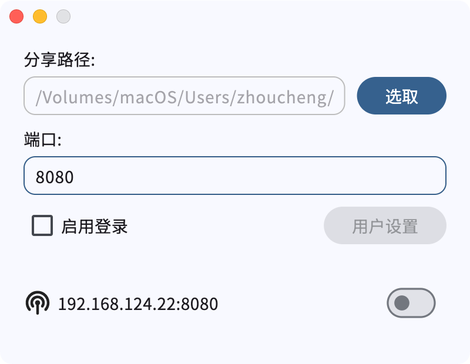

# Sharer-App

## 简介


这是一个用于将本机（Windows & Mac）作为文件服务器的App，可以在局域网内用各种设备通过网页访问

> [!NOTE]
> 这个项目是App本体，仓库中有二进制文件 (`assets/*`)，如果你要查找二进制文件的源代码请前往[Sharer-Core](https://github.com/Zhoucheng133/Sharer-Core)，如果你要查找网页的源代码请前往[Sharer-Web](https://github.com/Zhoucheng133/Sharer-Web)

> [!IMPORTANT]
> 有一定概率会被Windows Defender识别为病毒，但是程序本身没有问题，为了确保正常使用建议不要删除误判为病毒的可执行二进制文件，如果你很介意可以在你的设备上自行配置Sharer-Core（这种情况一般不会误报）

## 目录

- [简介](#简介)
- [截图](#截图)
- [使用](#使用)
- [在你的设备上配置Sharer-App](#在你的设备上配置sharer-app)
- [更新日志](#更新日志)

## 截图

### App



### 页面


## 使用

傻瓜式操作……不需要解释

## 在你的设备上配置Sharer-App

如果你需要手动构建Sharer-Core，你可以前往[Sharer-Core的仓库页面](https://github.com/Zhoucheng133/Sharer-Core)查看

### 环境配置

- Flutter (确保Dart版本不低于3.5.4)
- 准备好你的Sharer-Core二进制文件（项目中含有二进制文件，如果你不希望自己配置二进制文件可以忽略）

### 构建App

如果你自己构建了二进制文件，你需要将二进制文件复制到项目的assets文件夹中，命名应该是这样
```
assets
- core.exe  # Windows
- core      # macOS
```

之后你可以使用Visual Studio Code打开项目，我已经在仓库中建立了vscode启动配置，你可以进行Debug或者Release

## 更新日志

### 1.0.1 (2025/1/27)
- 添加分项路径Tooltip
- 修复无法退出的问题
- 修复macOS系统下的菜单语言问题

<details>
<summary>过去的版本</summary>

### 1.0.0 (2025/1/25)
- 第一个版本

</details>