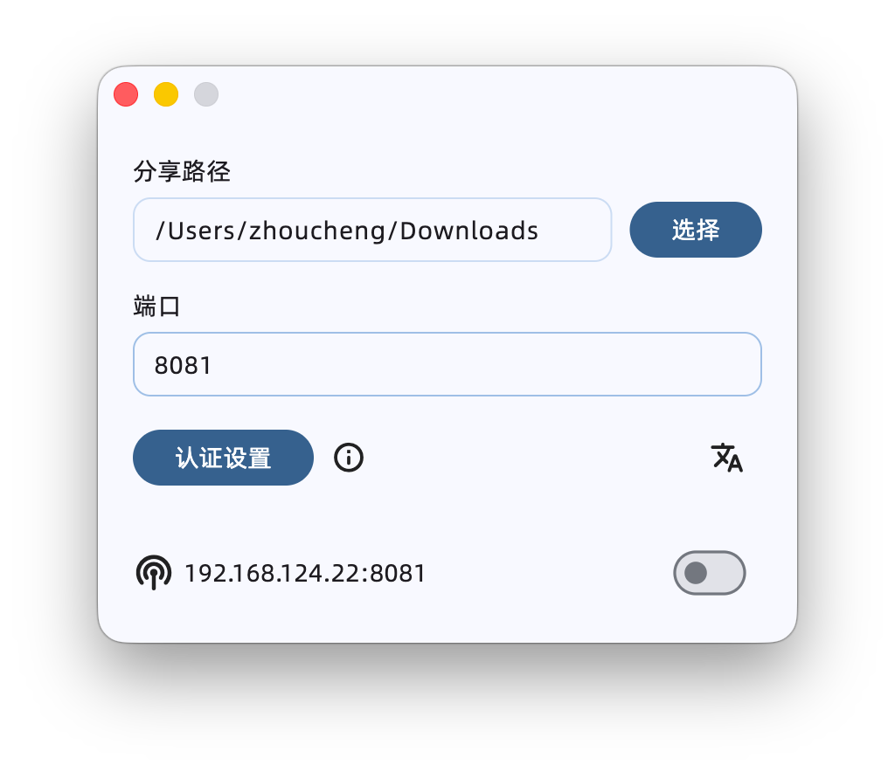
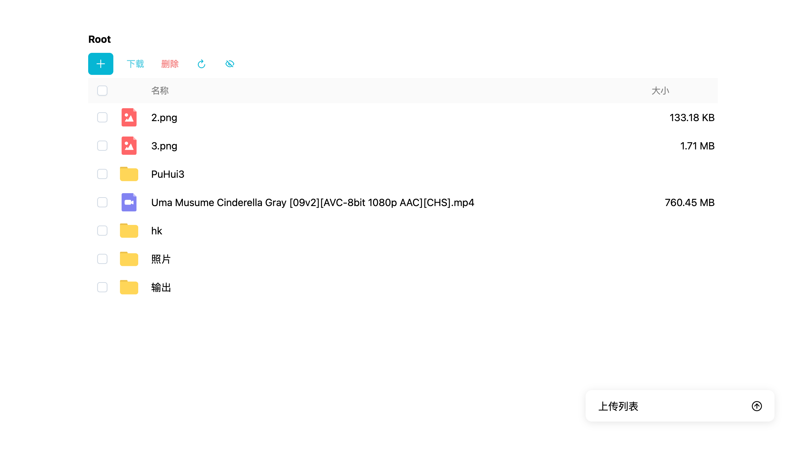

# Sharer-App

Also available in English. Click [HERE](/documents/en.md) to view the English version of the README

## 简介

这是一个用于将本机（Windows & Mac）作为文件服务器的App，可以在局域网内用各种设备通过网页访问

核心组件在这里：[Sharer-Core](https://github.com/Zhoucheng133/Sharer-Core)  
前端页面在这里：[Sharer-Web](https://github.com/Zhoucheng133/Sharer-Web)

## 目录

- [简介](#简介)
- [截图](#截图)
- [在你的设备上构建](#在你的设备上构建)

## 截图

### App

### 页面

> [!NOTE]
> 前端页面的语言跟随系统而不是App本体

## 在你的设备上构建

如果你需要手动构建Sharer-Core的动态库，你可以前往[Sharer-Core的仓库页面](https://github.com/Zhoucheng133/Sharer-Core)查看

你需要在你的设备上安装Flutter (本项目使用的Flutter `3.41`)

### 对于Windows系统

你需要先使用`flutter build windows`生成App，然后将动态库复制到App的目录（如何构建Windows动态库见[Sharer-Core](https://github.com/Zhoucheng133/Sharer-Core)仓库），**注意把它重命名为`libserver.dll`**）

### 对于macOS系统
1. 你需要提前把动态库文件复制到`/macos`这个文件夹中（如何构建macOS动态库见[Sharer-Core](https://github.com/Zhoucheng133/Sharer-Core)仓库），**注意把它重命名为`libserver.dylib`**）。  
   **`macos`文件夹中已有这个动态库，如果你想手动构建动态库请替换它，不想手动构建可以直接使用仓库内的**

2. 使用`flutter build macos`构建Sharer App即可

