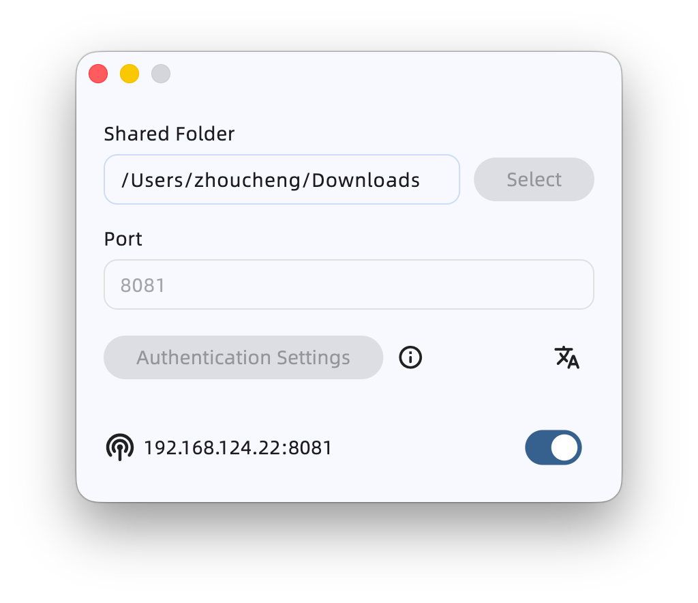
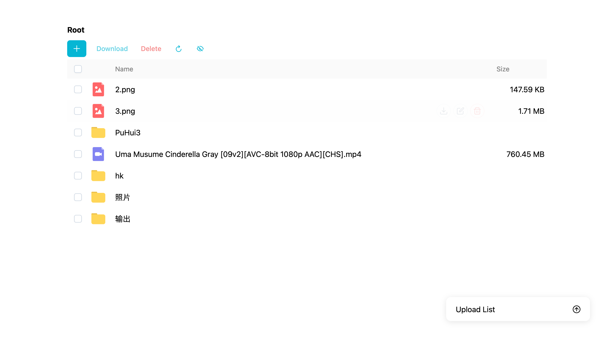
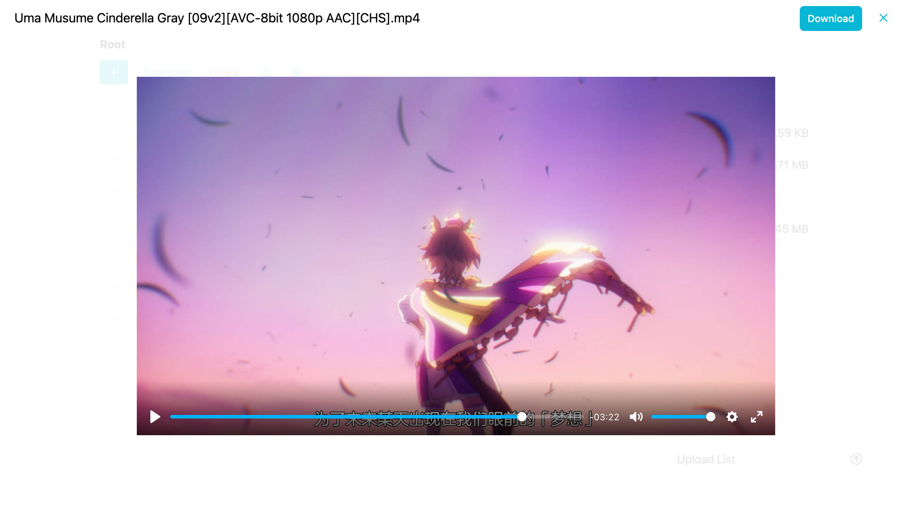

# Sharer-App

This is an app that turns your local machine (Windows & Mac) into a file server, allowing various devices to access files via a web browser within the local area network (LAN).

Core component: [Sharer-Core](https://github.com/Zhoucheng133/Sharer-Core)  
Frontend page: [Sharer-Web](https://github.com/Zhoucheng133/Sharer-Web)

## Table of Contents

- [Introduction](#introduction)
- [Screenshots](#screenshots)
- [Build on Your Device](#build-on-your-device)

## Screenshots

### App

### Web Page

> [!NOTE]
> The language of the frontend page follows the system language rather than the App itself.

## Build on Your Device

If you need to manually build the Sharer-Core dynamic library, please refer to the [Sharer-Core repository page](https://github.com/Zhoucheng133/Sharer-Core).

You need to have Flutter installed on your device (this project uses Flutter `3.41`).

### For Windows

First, use `flutter build windows` to generate the App. Then, copy the dynamic library to the App directory (refer to the [Sharer-Core](https://github.com/Zhoucheng133/Sharer-Core) repo for building the Windows library). **Note: You must rename it to `libserver.dll`**.

### For macOS

1. Copy the dynamic library file into the `/macos` folder in advance (refer to the [Sharer-Core](https://github.com/Zhoucheng133/Sharer-Core) repo for building the macOS library). **Note: You must rename it to `libserver.dylib`**.  
   **The `macos` folder already contains this library; if you wish to build it manually, please replace it. Otherwise, you can use the one provided in the repository.**

2. Simply run `flutter build macos` to build the Sharer App.